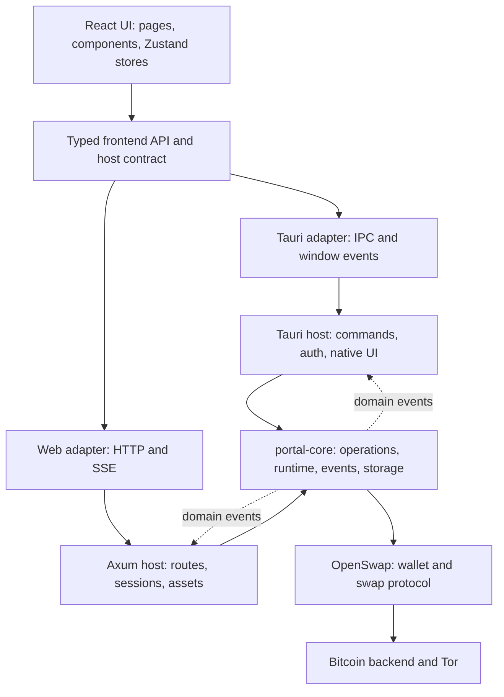

# Portal architecture for developers

Read this after the [README](../README.md) if you need to change Portal or trace a bug across the UI and Rust. The README keeps the setup and command reference; this guide explains the decisions behind the code's boundaries.

## Architecture at a glance

Portal has one React UI and two ways to run it. The desktop build hosts that UI in a Tauri window. The browser build serves it from an Axum server. Both hosts call the same Rust services, which adapt the [OpenSwap](https://github.com/citadel-foss/openswap) library into Portal's wallet, swap, and router operations.

In the UI, **Wallet** is the swap taker and **Router** is the maker. These roles share the application shell but have different runtime objects: a session unlocks a taker wallet, while routers have their own registrations, wallets, and lifecycle. Core keeps that distinction regardless of which host delivered the request.

[vite.config.ts](../vite.config.ts) selects [desktop.ts](../src/api/desktop.ts) or [web.ts](../src/api/web.ts) as `@host` at build time. Pages use typed [commands.ts](../src/api/commands.ts) functions and [platform/index.ts](../src/platform/index.ts) capabilities instead of calling IPC or HTTP directly. The alias keeps Tauri packages out of the web bundle.

| Area | Responsibility | Start here |
| --- | --- | --- |
| `src/` | React screens, shared components, state, and presentation | [App.tsx](../src/App.tsx), [pages/](../src/pages), [store/](../src/store) |
| `src/api/` | Typed commands, wire types, and the host adapter contract | [commands.ts](../src/api/commands.ts), [types.ts](../src/api/types.ts), [host-contract.ts](../src/api/host-contract.ts) |
| `core/` | Transport-independent wallet, router, swap, Tor, storage, and events | [lib.rs](../core/src/lib.rs), [ops/](../core/src/ops), [state.rs](../core/src/state.rs) |
| `src-tauri/` | Desktop IPC, owner sign-in, native dialogs, tray, and window lifecycle | [lib.rs](../src-tauri/src/lib.rs), [commands/](../src-tauri/src/commands) |
| `src-web/` | HTTP API, browser sessions, operation journal, SSE, and static UI | [main.rs](../src-web/src/main.rs), [routes.rs](../src-web/src/routes.rs), [commands.rs](../src-web/src/commands.rs) |
| `contracts/` | Inventory of which operations each host exposes | [operations.json](../contracts/operations.json) |

## From launch to an unlocked wallet

Each host creates an [AppState](../core/src/state.rs) for open wallets, routers, and events, then brings up Tor before wallet or router work needs it. Desktop adds a Tauri window, tray, native dialogs, and a single process session in [src-tauri/src/lib.rs](../src-tauri/src/lib.rs). The server adds [WebState](../src-web/src/state.rs), which owns browser authentication, request policy, and an operation journal around the same core runtime.

The route guards in [App.tsx](../src/App.tsx) reflect the startup order: restore sign-in, ask Rust whether a wallet is already open, pass the chain-backend and Tor connection gate, then enter Wallet or Router. Only wallet routes require an unlocked taker. Router pages can run without one because each router resolves its own wallet from its registration. A page reload replaces React state, not the host process, so the UI reads the current session state from Rust instead of assuming the wallet closed.

An unlocked wallet belongs to an authenticated session. [Taker initialization](../core/src/ops/taker_wallet.rs) keys the live instance by wallet data directory. If another session opens that wallet, Portal checks its password and joins the existing instance rather than creating a second OpenSwap taker over the same files. Browser tabs may share a session cookie; a tab is not automatically a separate wallet owner. [Router initialization](../core/src/ops/maker.rs) creates a registration, while starting its server is a separate lifecycle step.

## Follow one operation

For example, a swap starts in [SwapPage.tsx](../src/pages/swap/SwapPage.tsx) and calls a typed function in `src/api/commands.ts`. [transport.ts](../src/api/transport.ts) forwards that operation through the selected host adapter:

1. On desktop, `desktop.ts` uses Tauri IPC. A thin command in [src-tauri/src/commands/taker_swap.rs](../src-tauri/src/commands/taker_swap.rs) checks desktop-specific context, then calls `portal_core::ops::taker_swap`.
2. In a browser, `web.ts` posts to `/api/v1/commands/{name}`. [routes.rs](../src-web/src/routes.rs) authenticates the caller and applies request policy; [commands.rs](../src-web/src/commands.rs) decodes the operation's concrete arguments and calls the same core operation.
3. [core/src/ops/taker_swap.rs](../core/src/ops/taker_swap.rs) owns Portal's swap behavior and talks to OpenSwap. Core has no Tauri, Axum, or browser dependency; transport and session checks remain in the hosts.

The shapes crossing that boundary are maintained in [core/src/types.rs](../core/src/types.rs) and [src/api/types.ts](../src/api/types.ts). [AppError](../core/src/error.rs) gives both hosts a shared error code and message; the web adapter converts HTTP failures back into that shape so pages can handle the same errors in both builds.

### Why the web host handles some operations differently

The browser is a separate client that may disconnect while the server keeps running. [routes.rs](../src-web/src/routes.rs) authenticates requests, checks origin and CSRF where required, and dispatches only operations listed in [commands.rs](../src-web/src/commands.rs). It does not expose every desktop command: native dialogs, quitting, and server filesystem paths belong to their host.

For long-running or money-moving web operations, the client sends an idempotency key. The server records acceptance in the in-memory [journal](../core/src/operations.rs), then owns the work even if the tab closes. If the response is lost, [web.ts](../src/api/web.ts) looks up that key before reporting an outcome. An uncertain spend can block another conflicting spend for the same wallet until reconciled. The journal survives a tab closing, but not a server restart; OpenSwap's wallet and swap recovery data have their own persistence path.

## Where state lives

- **Rust runtime:** [AppState](../core/src/state.rs) owns live takers, router handles, session-to-wallet bindings, and domain events. [Chain backend settings](../core/src/ops/chain_backend.rs) live per session in memory; connection secrets are not persisted.
- **Disk:** [storage.rs](../core/src/storage.rs) resolves the OpenSwap data root and separate directories for wallets and routers. OpenSwap persists wallet and swap recovery files there; Portal also persists router settings and the owner credential. Browser requests never choose arbitrary server paths: uploads and downloads go through managed endpoints in [files.rs](../src-web/src/files.rs).
- **React:** [Zustand stores](../src/store) hold view state and caches. They do not decide whether a wallet is actually unlocked; [App.tsx](../src/App.tsx) restores that answer from the host after a reload.

[events.rs](../core/src/events.rs) publishes wallet and router notifications without knowing the host. Tauri forwards them as window events; the web host sends them over one server-sent event stream per tab and filters wallet events by session. Events may update a view or trigger a fresh read; after a reload or missed event, the UI must read the current state from Rust.

Work also has a longer lifetime than a page. Desktop hides the window on close while swaps or routers continue; closing a browser tab leaves the server running. On actual process shutdown, both hosts stop routers, then wallets, then Tor, so work using Tor can finish before it is torn down.

## Tools and dependencies

The UI uses React, TypeScript, React Router, and Zustand for in-memory view state; Vite and Tailwind CSS handle builds and styling. Tauri owns desktop integration, while Axum and Tokio serve browser requests. Portal's Rust core adapts the OpenSwap protocol crate and manages Tor through [core/src/tor.rs](../core/src/tor.rs). Consult [package.json](../package.json), the workspace [Cargo.toml](../Cargo.toml), and [Cargo.lock](../Cargo.lock) for current versions and the pinned OpenSwap revision.

## Build shape

The desktop package contains a Tauri host and a desktop-mode UI. The release server embeds its web-mode UI through [src-web/build.rs](../src-web/build.rs); during development, [scripts/web-dev.sh](../scripts/web-dev.sh) runs the API and Vite separately, with Vite proxying API requests to Axum. [config.rs](../src-web/src/config.rs) owns the server's bind address and deployment access profile.

## Making a change

1. **UI-only behavior:** change a page or component under `src/`; keep host-specific choices behind `src/platform/` capabilities. Before adding UI state, ask whether Rust already owns the answer.
2. **Wallet, swap, or router behavior:** change `core/src/ops/` and its DTOs in `core/src/types.rs`. Update the typed frontend call and `src/api/types.ts` when the wire contract changes.
3. **A new operation:** add the thin Tauri command, register it in `src-tauri/src/lib.rs`, and update `src-tauri/build.rs` and `src-tauri/capabilities/default.json` so it has an IPC permission. Add an explicit web operation only if a browser should be allowed to call it. Update `contracts/operations.json`, including its execution and retry class; host tests check these registrations. Keep browser-specific validation, path redaction, and durable handling in `src-web/`.
4. **Progress or lifecycle updates:** publish a named event in `core/src/events.rs` and subscribe through `src/api/transport.ts`. Also provide a fresh read so a reload or missed event can recover the current state.

For a shared operation, exercise both hosts if possible: browser request policy and native window behavior are checked through different paths.

[check.yml](../.github/workflows/check.yml) defines the current typecheck, build, lint, and test gates; [build.yml](../.github/workflows/build.yml) defines CI artifacts. When changing the OpenSwap dependency, [scripts/sync.sh](../scripts/sync.sh) updates its pinned revision and verifies the stack.
