# Portal user guide

This guide walks you from a fresh install to your first private swap. The desktop app and the
server version (in a browser, or on Umbrel) work the same way; the screenshots show both.

- [1. Sign in](#1-sign-in)
- [2. Connect](#2-connect)
- [3. Choose a role](#3-choose-a-role)
- [4. Set up a wallet](#4-set-up-a-wallet)
- [5. Your wallet](#5-your-wallet)
- [6. Send and receive (Tx)](#6-send-and-receive-tx)
- [7. Swap](#7-swap)
- [8. If a swap stops](#8-if-a-swap-stops)
- [9. The market](#9-the-market)
- [10. Back up your wallet](#10-back-up-your-wallet)
- [11. Run a router](#11-run-a-router)

## 1. Sign in

The first time you open Portal, choose a **Portal password** (at least 8 characters). After that,
Portal asks for it every time it starts. This password protects the app itself. Each wallet has
its own password on top of it.

## 2. Connect

Pick the Electrum server Portal reads the blockchain from. The list has servers for each
network, and the badge next to each name shows which one it is: **Portal signet** for testing, or a
public server such as **Blockstream** for mainnet. **Edit** lets you enter another server.

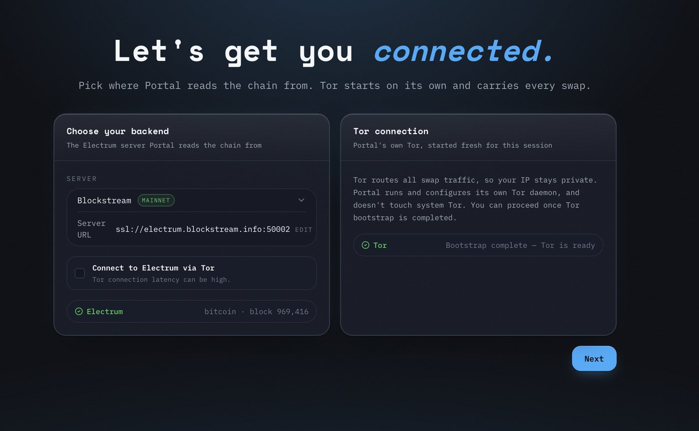

To reach the Electrum server through Tor too, so it does not see your IP address, check the
**Connect to Electrum via Tor** box. This can be slower. Swaps always go over Tor either way:
Portal runs its own Tor, and **Next** unlocks once Tor is ready and the server has answered.

## 3. Choose a role

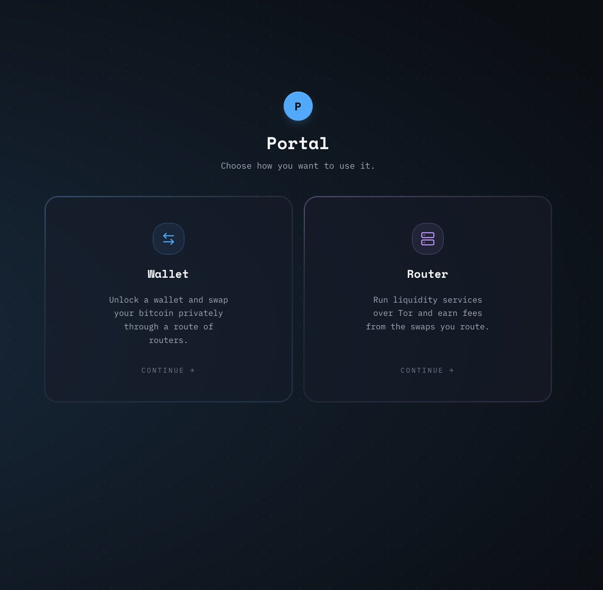

- **Wallet**: hold bitcoin and swap it privately. Start here if you are new.
- **Router**: provide liquidity for other people's swaps and earn fees. See
  [Run a router](#11-run-a-router).

## 4. Set up a wallet

Portal lists the wallets it finds. Pick one and enter its password, or:

- **Create a new wallet**: enter a name and a password (at least 8 characters).
- **Restore backup**: choose an encrypted backup file, give the wallet a name, and enter the
  backup's password.

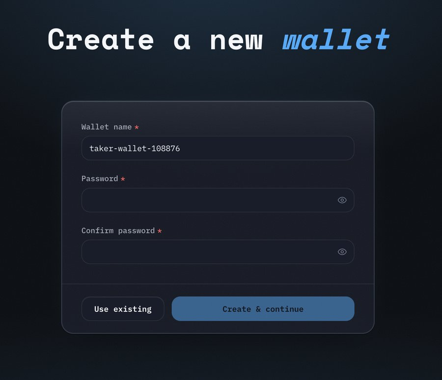

> [!WARNING]
> There is no way to recover a wallet password. If you lose it, you lose access to the funds. Keep
> it somewhere safe, and [make a backup](#10-back-up-your-wallet).

Portal then connects, loads the list of routers and starts watching your contracts. This can take
a minute.

## 5. Your wallet

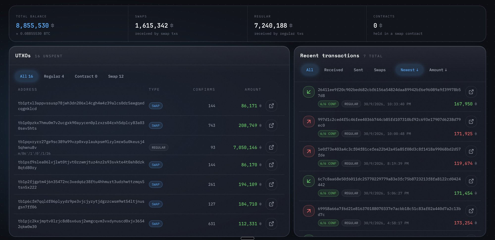

The top row shows your balance, split into:

- **Swaps**: coins you received from swaps.
- **Regular**: coins you received normally.
- **Contracts**: coins locked in a swap that is still in progress or being recovered.

Below are your coins (UTXOs) and your transaction history. Click a transaction, or the arrow on a
coin, to open it in a block explorer.

The badge at the top right shows the network you are on (for example **SIGNET** or
**MAINNET**). The top bar also has the **Wallet**, **Market**, **Tx** and **Swap** pages, and a
link to the **Router Console**.

## 6. Send and receive (Tx)

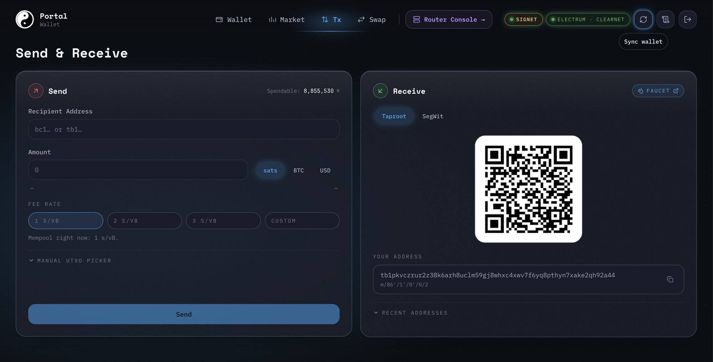

**To receive**, open **Tx**, choose **Taproot** or **SegWit**, and share the address or QR code.
Portal moves to a fresh address once this one has been paid, and **Recent addresses** lists the
ones you used before. On signet, **Faucet** gets you free test coins.

**To send**:

1. Paste the recipient's address and enter the amount. You can type it in sats, BTC or USD.
2. Pick a fee rate. It starts at 2 sat/vB, and Portal shows what the mempool is asking right now.
   Pick a higher preset, or **Custom**, to confirm faster.
3. Optionally, open **Manual UTXO picker** to choose exactly which coins to spend.
4. Press **Send**. Portal shows the network fee and the total, and warns you if the fee looks too
   high. Check them, then broadcast.

A broadcast cannot be undone.

## 7. Swap

A swap sends your coins through a chain of routers and brings back different coins, so nobody can
link the two. Every step goes over Tor.

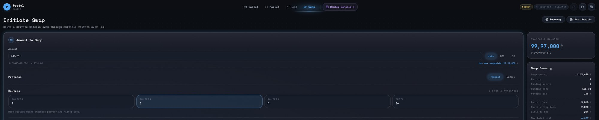

1. Open **Swap** and enter an amount. **Use max swappable** fills in the most you can swap.
2. Choose the **Protocol**: **Taproot** (the default) or **Legacy**.
3. Choose how many **Routers** to route through. More routers means more privacy and higher fees.
4. **Advanced options** let you pick specific routers or specific coins. Leave them unticked to let
   Portal choose.
5. Check the **Swap Summary** on the right: the fees, and the least you will receive.
6. Press **Start Swap**. Portal agrees terms with each router. No funds move yet.
7. Review the terms the routers agreed to. If a router raised its fee since the quote, Portal
   highlights it. Press **Start swap** to go ahead, or **Cancel** to go back.

> [!IMPORTANT]
> Keep Portal running until the swap finishes. If it stops or crashes during a swap, start it
> again as soon as you can.

While it runs, the circle shows each hop confirming in turn. When it finishes, the coins are
swept to your wallet and spendable.

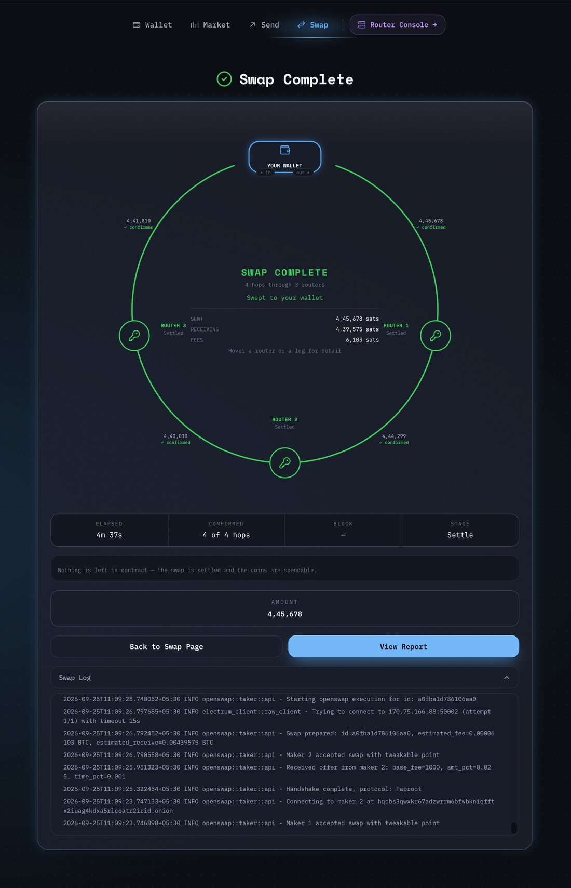

**View Report** shows what the swap cost. **Swap Reports**, at the top of the Swap page, lists
every past swap.

## 8. If a swap stops

If a swap fails after funds have moved, Portal claims them back for you automatically. Your coins
sit in a contract until then. Open **Recovery** on the Swap page to follow it: it shows each
contract and how many blocks are left before it can be claimed. Portal needs to be running for
this, so leave it open until recovery finishes.

## 9. The market

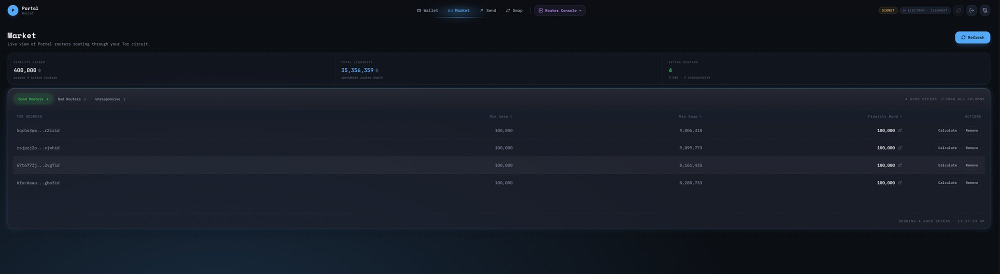

**Market** lists the routers Portal can see, with each one's swap limits and fidelity bond. A
fidelity bond is bitcoin a router has locked up, which makes it expensive to flood the market with
fake routers. **Calculate** shows what a swap through that router would cost.

## 10. Back up your wallet

At the bottom of the **Wallet** page, **Create backup** saves an encrypted copy of your wallet's
keys.

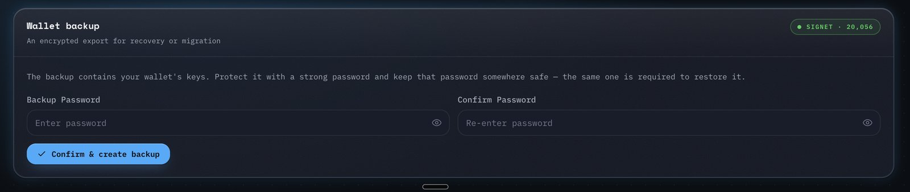

1. Press **Create backup**.
2. Enter a strong backup password (at least 8 characters), and enter it again to confirm.
3. Press **Confirm & create backup**. The desktop app asks where to save the file; in a browser,
   it downloads.

You need the same password to restore it. The backup holds your keys only, not your swap history.

## 11. Run a router

A router supplies liquidity for other people's swaps and earns a fee on each one. Open it with
**Router** on the role screen, or **Router Console** from a wallet.

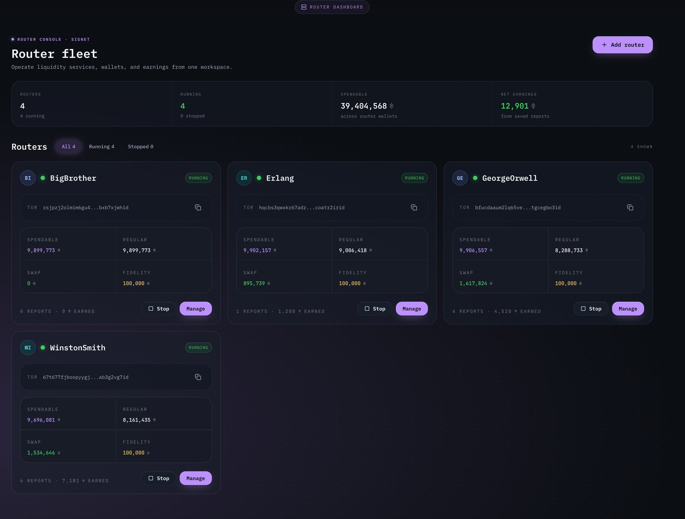

**To add a router**:

  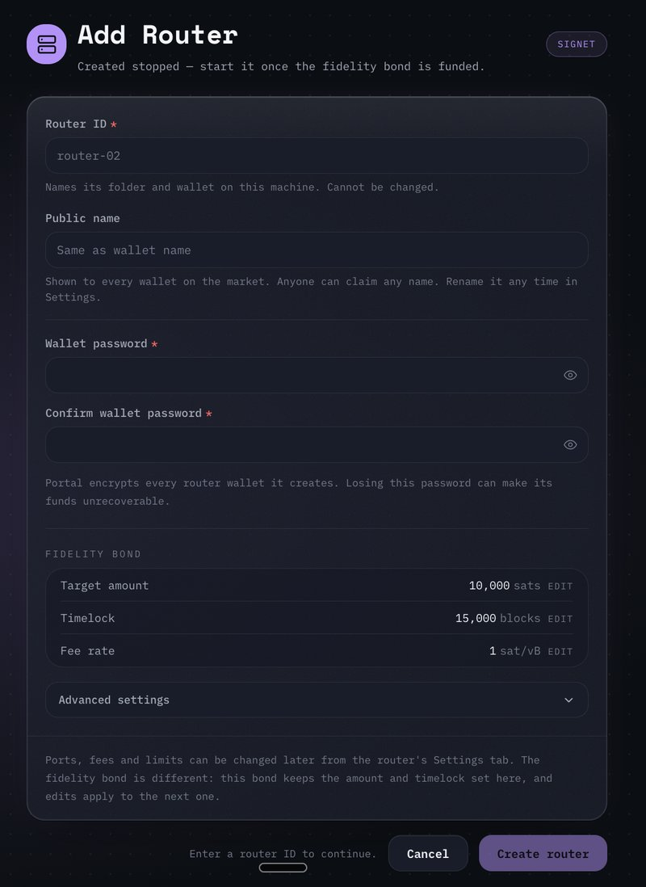

1. Press **Add router**.
2. Give it a **Router ID** (letters, numbers, hyphens and underscores). It names the router's
   folder and wallet, and cannot be changed later.
3. Optionally, set a **Public name**: the name wallets see in the market. You can rename it any
   time in **Settings**.
4. Choose a **Wallet password** and confirm it. Losing it can make the router's funds
   unrecoverable.
5. Check the **Fidelity bond**: the amount to lock, how many blocks to lock it for, and the fee
   rate for the bond transaction. Defaults are filled in. **Advanced settings** holds the fees,
   ports and limits, which you can also change later in **Settings**.
6. Press **Create router**. The router is created stopped.
7. Start it. It shows a deposit address: send at least the amount shown there. Once the deposit
   confirms, the router creates its fidelity bond and starts serving swaps. You can stop it at any
   point while it waits.

The **Router fleet** page shows every router, its balances and what it has earned. **Start** and
**Stop** control each one. **Manage** opens its workspace:

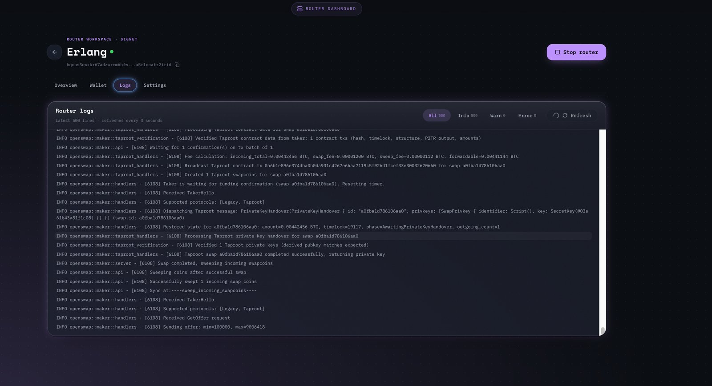

- **Overview**: its balances, fidelity bond and swap reports.
- **Tx**: the router's balances and coins. Send funds out from here.
- **Logs**: what the router is doing, live.
- **Settings**: its public name, fees, fidelity bond and ports.

A router only earns while it is running, so keep Portal running.
